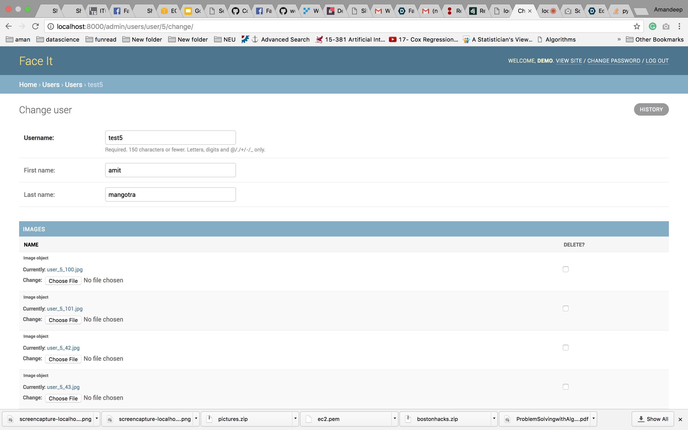

# Face Recognition // Boston Hacks 2017 
[Devpost Link](https://devpost.com/software/verafai#updates)

## Members

* Keval Khara
* Devin Dyson
* Brian Pham
* Amandeep Singh
* Amit Mangotra

## Inspiration

The National Health Care Anti-Fraud Association estimates that health care fraud costs the United States about $68 billion annually. Roughly 3% of the nation's $2.26 trillion annual health care expenditure.

The following data represents Blue Cross Blue Shield of Michigan's fraud investigation unit activity from July 1980 to March 2017.

Cases opened: 51,322 Cases closed: 50,324 Referred for recovery/cost savings: $402,716,325.25

According to these statistics there is a huge opportunity to implement a more substantial identity-verification process in Hospitals and Clinics for point of care service.

## What It Does

1. Create user (PatientID)
2. Train PatientID using OpenCV
3. Admin captures an image of the patient
4. OpenCV maps a PatientID to the image of patient
5. Displays stored patient information

## How we Built it

1. Create a virtual environment
2. Install the packages pip install -r req.txt
3. Python manage.py migrate python mange.py runserver and you're good to go on at localhost:8000

## Challenges Faced

Up until the near end of our project, we had split ourselves into two teams, one working on the facial recognition, the other working on the front and back-end. When it came time to combine our efforts, we had some problems integrating the facial recognition in a way that works well with the front and back-end developers. Also, the android application could not be completed in the given time as our planned minimum viable product was web application.

## Accomplishments 

Integration was very challenging. Major props to Aman and Brian for figuring out how to connect OpenCV to Django, and to Amit for creating the frontend web camera that would eventually communicate with both backend frameworks. Although Keval's Andoid Application for face detection and recognition didn't find the time to be integrated, we give him major props for expending much mental energy trying to figure out the build and deploying an Android emulator.

## What we Learned

OpenCV is one of the more difficult Computer Vision libraries that's available as open source. Even though we could've used Microsoft Azure's Face API to run facial recognition, we learned a lot more about histogram of oriented gradients (HOG) by using OpenCV and coding from scratch.

## What's next for *FaceIT*

We would like to see our solution adopted by some Hospital Management Systems or perhaps some Clinical Research Organizations. Test cases could roll out in private clinics so that we could work out any bugs. Scalability and integration for a simple solution like this should be seamless once the kinks are ironed out.

## Built With

OpenCV, Django, Python, JavaScript, HTML, CSS

## Interface

